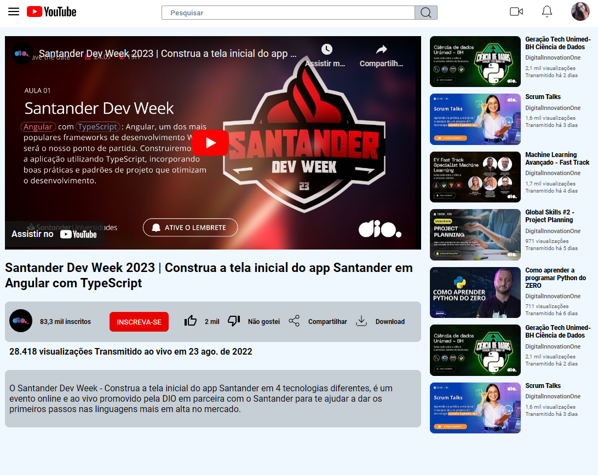

 # Clone Pagina Youtube com CSS

### Por Michele Queiroz Ambrosio

>O objetivo é ensinar os principais conceitos, 
aplicações e propriedades que envolvem o flexbox.

---

1. Contêiner Flex (Flex Container):

O elemento pai que possui os itens flexíveis é chamado de contêiner flex. Para transformar um elemento em um contêiner flex, você define `display: flex` ou `display: inline-flex`para ele.

2. Itens Flexíveis (Flex Items):

Os elementos filhos diretos do contêiner flex são chamados de itens flexíveis. Eles se tornam flexíveis ao serem colocados no contexto de um contêiner flex.

3. Eixo Principal e Transversal:

O contêiner flex possui um eixo principal e um eixo transversal. O eixo principal é definido pela propriedade `flex-direction` e o eixo transversal é perpendicular a ele.

4. Justificação e Alinhamento:

Propriedades como `justify-content` são usadas para alinhar os itens ao longo do eixo principal, enquanto align-items é usada para alinhar os itens ao longo do eixo transversal.

5. Ordem dos Itens:

A propriedade `order` permite que você controle a ordem visual dos itens dentro do contêiner flex, independentemente da ordem no HTML.

6. Espaçamento e Crescimento Automático:

O espaço restante no contêiner pode ser distribuído entre os itens usando `flex-grow, flex-shrink`, e `flex-basis.` Isso é útil para criar layouts flexíveis e responsivos.

## Desafio de Flexbox

Criação da pagina do Youtube usando flexbox CSS.

## Conclusão

Concluir o desenvolvimento da página foi um desafio enriquecedor, destacando a gratificação que advém da criação de um projeto significativo. Contudo, ressalta-se a necessidade de dedicação contínua e consistência no aprendizado, especialmente quando se trata da utilização do CSS de maneira escalável e limpa. Esse processo reforça a importância de manter-se atualizado e comprometido com as melhores práticas, proporcionando não apenas um produto final impressionante, mas também um crescimento constante na proficiência e eficiência do desenvolvimento web.

[Link clone youtube 😄](https://luizfcs35.github.io/Desafio.CSS-clone.Youtube/)

